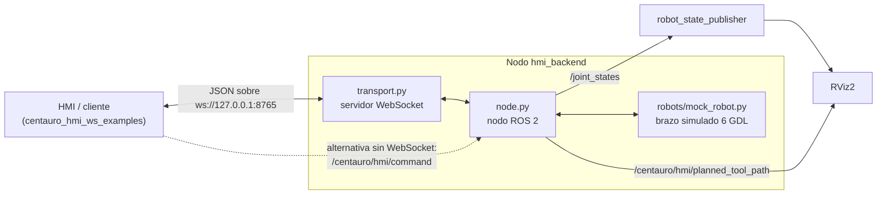

# CENTAURO HMI

Servidor WebSocket que expone un contrato de teleoperación para un brazo
robótico de seis articulaciones, más un conjunto de clientes de ejemplo.

La HMI (o cualquier cliente) se conecta por WebSocket, envía comandos JSON
(habilitar teleoperación, jog, planificar y ejecutar trayectorias…) y recibe
telemetría periódica. El backend está diseñado para conectarse indistintamente a
un robot real, a uno simulado o a un mock, siempre detrás del mismo contrato.

Por ahora solo está implementado el modo **mock**.

## Arquitectura



El transporte, el contrato de mensajes y la implementación del robot están
separados: sustituir el mock por un robot real no debería cambiar el contrato
que ve la HMI.

## Paquetes

| Paquete | Contenido |
| --- | --- |
| [centauro_hmi_backend](centauro_hmi_backend/README.md) | Nodo ROS 2 con el servidor WebSocket, el robot mock, el URDF de visualización y los launch files. Incluye el [contrato WebSocket](centauro_hmi_backend/docs/WEBSOCKET_PROTOCOL.md). |
| [centauro_hmi_ws_examples](centauro_hmi_ws_examples/README.md) | Clientes WebSocket ejecutables para probar y entender el contrato sin escribir código. |

## Requisitos

- Ubuntu 24.04 con ROS 2 Jazzy instalado en `/opt/ros/jazzy`.
- Python 3.12 y la librería `websockets`.

## Instalación

Este repositorio contiene los dos paquetes ROS 2, así que hay que clonarlo
dentro del directorio `src/` de un workspace colcon. Sirve cualquier
workspace; en los ejemplos siguientes su ruta se guarda en `ROS_WS`:

```bash
export ROS_WS=~/ros2_ws          # cualquier ruta que quieras usar
mkdir -p "$ROS_WS/src"
cd "$ROS_WS/src"
git clone <url-del-repositorio> centauro_hmi_backend
```

Instalar dependencias y compilar:

```bash
sudo apt update
sudo apt install python3-websockets
source /opt/ros/jazzy/setup.bash
cd "$ROS_WS"
colcon build --symlink-install
source install/setup.bash
```

> `source install/setup.bash` hay que repetirlo en **cada** terminal nueva,
> siempre después de `source /opt/ros/jazzy/setup.bash`.

## Primer arranque

Dos terminales, ambas con el workspace cargado.

**Terminal A — backend + visualización:**

```bash
ros2 launch centauro_hmi_backend complete.launch.py
```

Debería abrirse RViz2 con un brazo de seis articulaciones y, en la consola,
un resumen de estadísticas cada 5 segundos.

**Terminal B — cliente de prueba:**

```bash
ros2 run centauro_hmi_ws_examples ws_protocol_smoke_test
```

Se conecta a `ws://127.0.0.1:8765`, espera un mensaje de telemetría y pide el
catálogo de poses. No mueve el robot. Si imprime la telemetría, el sistema
está funcionando.

Para ver el brazo moverse:

```bash
ros2 run centauro_hmi_ws_examples ws_teleoperation_demo
```

## Siguientes pasos

- [Contrato WebSocket completo](centauro_hmi_backend/docs/WEBSOCKET_PROTOCOL.md):
  todos los comandos, mensajes, frecuencias y watchdogs.
- [README del backend](centauro_hmi_backend/README.md): parámetros, topics ROS 2,
  launch files y tests.
- [README de los ejemplos](centauro_hmi_ws_examples/README.md): qué hace cada
  cliente y en qué orden probarlos.

## Problemas frecuentes

| Síntoma | Causa habitual |
| --- | --- |
| `Package 'centauro_hmi_backend' not found` | Falta `source "$ROS_WS/install/setup.bash"` en esa terminal. |
| `ModuleNotFoundError: websockets` | Falta `sudo apt install python3-websockets`. |
| `address already in use` al arrancar | El puerto 8765 está ocupado por otra instancia; ciérrala o cambia `websocket_port` en `centauro_hmi_backend/config/backend.yaml`. |
| El cliente no conecta | El backend no está arrancado, o escucha en otro host/puerto. Comprueba `--url` en el cliente. |
| `RuntimeError` al usar `robot.type: real` | Es esperado: la integración con el robot real todavía no está implementada. |
