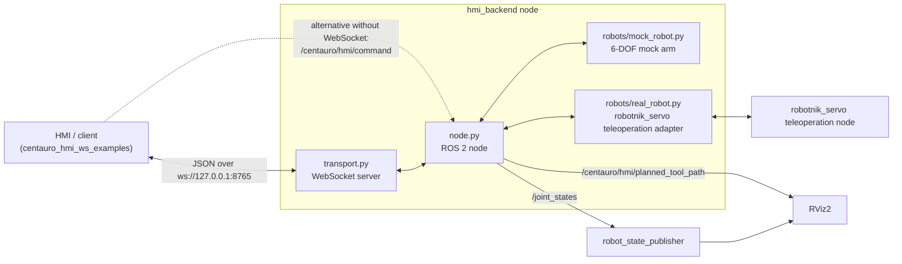

# CENTAURO HMI

A WebSocket server that exposes a teleoperation contract for a six-joint robotic
arm, along with a set of example clients.

The HMI (or any client) connects over WebSocket, sends JSON commands (enable
teleoperation, jog, plan and execute trajectories, and more), and receives
periodic telemetry. The backend selects a mock robot or a real robot adapter
through `robot.type`, while keeping the same HMI-facing contract.

The `mock` adapter is available for development and testing. The `real` adapter
interfaces with packages for teleoperation and joint-state feedback;
planning and other unsupported capabilities are documented in the backend
[README](centauro_hmi_backend/README.md).

## Architecture


```mermaid
flowchart LR
    HMI["HMI / client<br/>(centauro_hmi_ws_examples)"]
    subgraph backend["hmi_backend node"]
        T["transport.py<br/>WebSocket server"]
        N["node.py<br/>ROS 2 node"]
        M["robots/mock_robot.py<br/>6-DOF mock arm"]
        A["robots/real_robot.py<br/>robotnik_servo teleoperation adapter"]
        T <--> N
        N <--> M
        N <--> A
    end
    TELEOPERATION_NODE["robotnik_servo teleoperation node"]
    RSP["robot_state_publisher"]
    RVIZ["RViz2"]

    HMI <-->|"JSON over ws://127.0.0.1:8765"| T
    HMI -.->|"alternative without WebSocket:<br/>/centauro/hmi/command"| N
    A <--> TELEOPERATION_NODE
    N -->|"/joint_states"| RSP --> RVIZ
    N -->|"/centauro/hmi/planned_tool_path"| RVIZ
```

The transport, message contract, and robot implementation are separate: switching
between the mock and real adapters does not change the contract seen by the HMI.

## Packages

| Package | Contents |
| --- | --- |
| [centauro_hmi_backend](centauro_hmi_backend/README.md) | ROS 2 node with the WebSocket server, mock and `robotnik_servo` teleoperation adapters, visualization URDF, and launch files. Includes the [WebSocket contract](centauro_hmi_backend/docs/WEBSOCKET_PROTOCOL.md). |
| [centauro_hmi_ws_examples](centauro_hmi_ws_examples/README.md) | Executable WebSocket clients for testing and exploring the contract without writing code. |

## Requirements

- Ubuntu 24.04 with ROS 2 Jazzy installed at `/opt/ros/jazzy`.
- Python 3.12.
- For real-robot mode, the `robotnik_servo` package and its robot driver/controller dependencies must be available in a sourced ROS 2 workspace.

## Installation

This repository contains both ROS 2 packages, so clone it into the `src/`
directory of a colcon workspace. Any workspace will work; the examples below
store its path in `ROS_WS`:

```bash
export ROS_WS=~/ros2_ws          # choose any workspace path
mkdir -p "$ROS_WS/src"
cd "$ROS_WS/src"
git clone <repository-url> centauro_hmi_backend
```

Install build tools and Python dependencies, then install the ROS dependencies declared by both packages:

```bash
sudo apt update
sudo apt install python3-colcon-common-extensions python3-rosdep \
  python3-websockets python3-yaml python3-pytest
source /opt/ros/jazzy/setup.bash
sudo rosdep init  # Run once per machine; skip if rosdep is already initialized.
rosdep update
cd "$ROS_WS"
rosdep install --from-paths src --ignore-src --rosdistro jazzy -r -y
colcon build --symlink-install
source install/setup.bash
```

`rosdep` installs the ROS 2 dependencies declared in the package manifests,
including `rclpy`, message packages, launch, RViz2, and `robot_state_publisher`.
The custom `robotnik_servo` package is not provided by this repository: for
`robot.type: real`, add/build its source package (and the robot driver packages)
in the same workspace or source the workspace where they are already installed.

> Run `source install/setup.bash` in **every** new terminal, after running
> `source /opt/ros/jazzy/setup.bash`.

## First Run

Use two terminals, and source the workspace in both.

**Terminal A: backend and visualization**

```bash
ros2 launch centauro_hmi_backend complete.launch.py
```

RViz2 should open with a six-joint arm. The console should print a statistics
summary every five seconds.

**Terminal B: test client**

```bash
ros2 run centauro_hmi_ws_examples ws_protocol_smoke_test
```

The client connects to `ws://127.0.0.1:8765`, waits for a telemetry message,
and requests the pose catalog. It does not move the robot. If telemetry is
printed, the system is running.

To move the arm:

```bash
ros2 run centauro_hmi_ws_examples ws_teleoperation_demo
```

## Further Reading

- [Full WebSocket contract](centauro_hmi_backend/docs/WEBSOCKET_PROTOCOL.md):
  commands, messages, frequencies, and watchdogs.
- [Backend README](centauro_hmi_backend/README.md): parameters, ROS 2 topics,
  launch files, and tests.
- [Examples README](centauro_hmi_ws_examples/README.md): what each client does
  and the recommended order for trying them.

## Troubleshooting

| Symptom | Common cause |
| --- | --- |
| `Package 'centauro_hmi_backend' not found` | Run `source "$ROS_WS/install/setup.bash"` in that terminal. |
| `ModuleNotFoundError: websockets` | Install it with `sudo apt install python3-websockets`. |
| `address already in use` on startup | Another instance is using port 8765. Stop it or change `websocket_port` in `centauro_hmi_backend/config/backend.yaml`. |
| The client cannot connect | The backend is not running or is listening on a different host or port. Check the client's `--url`. |
| Error with `robot.type: real` | The adapter uses the `robotnik_servo` teleoperation node. Ensure the package is installed and sourced, the teleoperation node is running, and its services are available. Also rebuild the workspace and source its `install/setup.bash`. |
